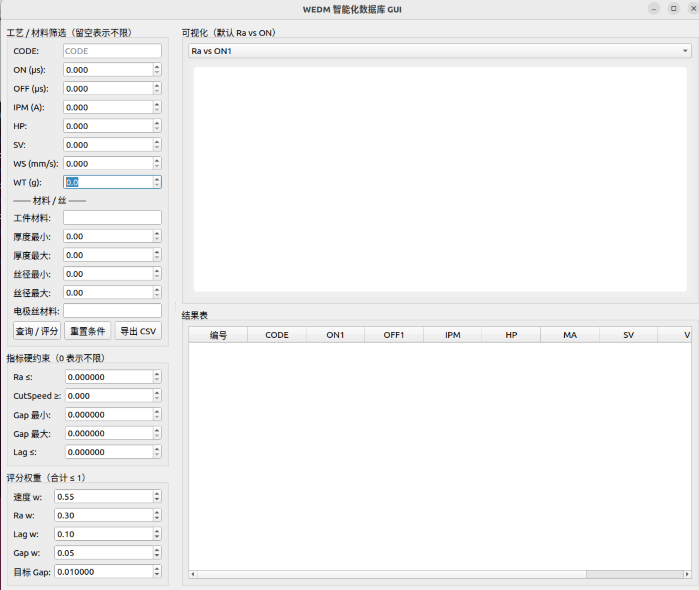

# 目前界面

# 改进方向
1、工件材料，设置几个固定的材料供下拉菜单选择
2、工件厚度是确定的。换言之，左侧明确输入。所需要查询的工件厚度、工件材料、**重熔层**相关的。指标约束什么的可以做按钮，点进去再进行配置

# 重熔层
这一块的金相检测，限制的要求有点太多了。这里可能需要更加细化，这个筛选要求，或者说单独把重熔层的筛选作为一个开关要求去增加。不作为基础功能

# 11.28修改方向

硬性指标约束、评分权重这一部分
完善推荐算法部分代码的构建，可以不用追求推荐结果的准确性，但是要把算法入口的框架整理清楚

工件的参数并没有实际参与进计算当中，这部分的实践性有待提高，还需要进一步优化